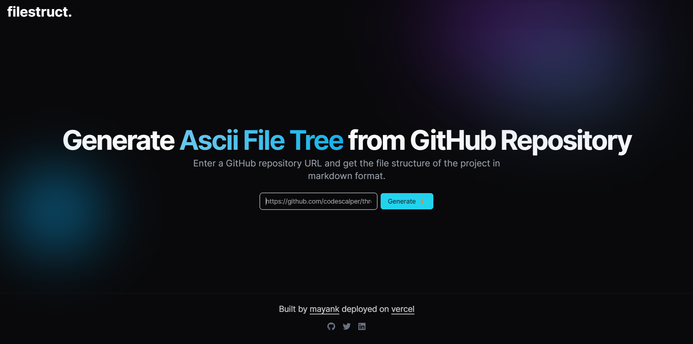

<p align="center">
<a href=https://github.com/codescalper/filestruct-rust target="_blank">

</a>
</p>

<p align="center">


</p>

## 📌 Overview

FileStruct is a project developed using Next.js 13 with Shadcn for UI. It allows users to generate an ASCII file tree by pasting a GitHub repository link. The project is deployed on Vercel, offering a user-friendly interface for visualizing the structure of GitHub repositories.

## 🔍 Table of Contents

- [📁 Project Structure](#project-structure)

- [📝 Project Summary](#project-summary)

- [💻 Stack](#stack)

- [🚀 Run Locally](#run-locally)

- [🙌 Contributors](#contributors)

## 📁 Project Structure

```bash
├── .eslintrc.json
├── .gitignore
├── README.md
├── app
│   ├── favicon.ico
│   ├── generate
│   │   └── page.tsx
│   ├── globals.css
│   ├── layout.tsx
│   └── page.tsx
├── components.json
├── components
│   ├── Footer.tsx
│   ├── Form.tsx
│   ├── Header.tsx
│   ├── ProjectStruct.tsx
│   ├── theme-provider.tsx
│   └── ui
│       ├── button.tsx
│       ├── input.tsx
│       ├── toast.tsx
│       ├── toaster.tsx
│       └── use-toast.ts
├── lib
│   ├── fileTree.ts
│   └── utils.ts
├── next.config.js
├── package-lock.json
├── package.json
├── postcss.config.js
├── public
│   ├── next.svg
│   └── vercel.svg
├── state
│   └── tree-structure.ts
├── tailwind.config.ts
├── tsconfig.json
└── types
    └── index.ts
```

## 📝 Project Summary

- [**app**](app): Main application logic and entry point.
- [**components**](components): Reusable UI components used throughout the application.
- [**lib**](lib): External libraries or utility functions used in the project.
- [**public**](public): Static assets accessible to the public.
- [**state**](state): State management code, such as Redux reducers and actions.
- [**types**](types): Custom type definitions used in the project.
- [**app/generate**](app/generate): Code related to generating or scaffolding new files or components.
- [**components/ui**](components/ui): UI-specific components used in the application.
- [**app/generate**](app/generate): Code related to generating or scaffolding new files or components.
- [**app/generate**](app/generate): Code related to generating or scaffolding new files or components.

## 💻 Stack

- [axios](https://axios-http.com/): Promise-based HTTP client for making API requests.
- [next](https://nextjs.org/): React framework for building server-rendered applications.
- [react](https://reactjs.org/): JavaScript library for building user interfaces.
- [react-dom](https://reactjs.org/docs/react-dom.html): Package for rendering React components in the browser.
- [react-icons](https://react-icons.github.io/react-icons/): Collection of popular icons as React components.
- [tailwindcss](https://tailwindcss.com/): Utility-first CSS framework for quickly building custom designs.
- [zustand](https://github.com/pmndrs/zustand): Small and fast state management library for React.
- [typescript](https://www.typescriptlang.org/): Typed superset of JavaScript that compiles to plain JavaScript.

## 🚀 Run Locally

1.Clone the filestruct-rust repository:

```sh
git clone https://github.com/codescalper/filestruct-rust
```

2.Install the dependencies with one of the package managers listed below:

```bash
npm install
```

3.Start the development mode:

```bash
npm run dev
```

## 🙌 Contributors

<a href="https://github.com/codescalper/filestruct-rust/graphs/contributors">

</a>
